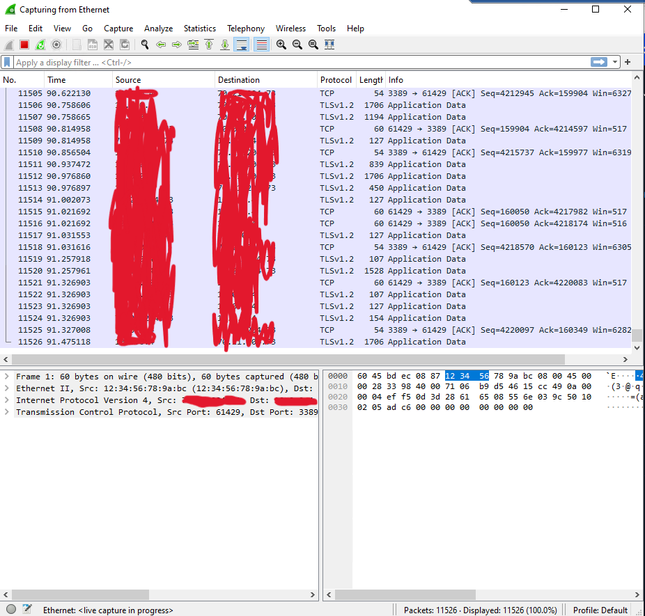
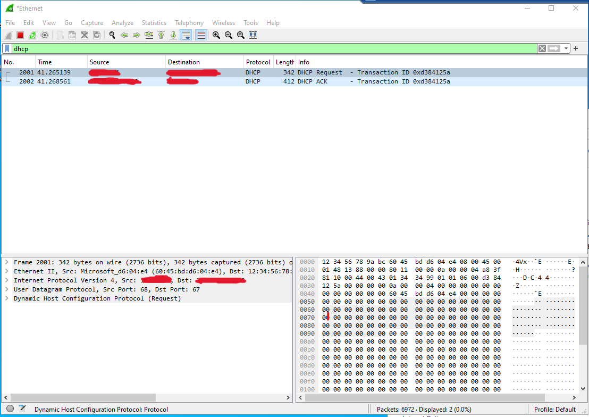

<h1>Microsoft Azure - Computing & Networking</h1>

 ### [YouTube Demonstration](https://youtu.be/7eJexJVCqJo)

<h2>Description</h2>
Project consists of observing ICMP traffic, SSH traffic, DHCP traffic, DNS Traffic, nad RDP traffic. Observing ICMP traffic includes remote desktopping to Windows 10 VM pinging IP addresses of other machines, installing Wireshark and filtering it for ICMP traffic.Observing SSH Traffic includes filtering out SSH traffic by SSHing into the Ubuntu VM. Observing DHCP traffic includes filtering for DHCP traffic. Observing DNS Traffic includes filtering for DNS traffic in Wireshark and using nslookup. 
<br />


<h2>Languages and Utilities Used</h2>

- <b>Vnet & Subnet</b> 
- <b>Network Watcher</b>
- <b>Wireshark</b>
- <b>Powershell</b>
- <b>Internet Protocols</b>

<h2>Environments Used </h2>

- <b>Windows 10</b> (21H2)
- <b>Linux (Ubuntu)</b> 

<h2>Program walk-through:</h2>

<p align="center">
<br/>Filter ICMP Traffic (Wireshark): <br/>
<!--  -->
<br />
<br />
Ping Ubuntu VM form Windows 10 VM  <br/>
<!--  -->
<br />
<br />
Block Traffic NSG  <br/>
<!--  -->
<br />
<br />
Re-enable NSG  <br/>
<!--  -->
<br />
<br />
SSH into Ubuntu VM <br/>
<!--  -->
<br />
<br />
Observe DHCP traffic in Wireshark:  <br/>
<!--  -->
<br />
<br />
</p>

<!--
 ```diff
- text in red
+ text in green
! text in orange
# text in gray
@@ text in purple (and bold)@@
```
--!>
